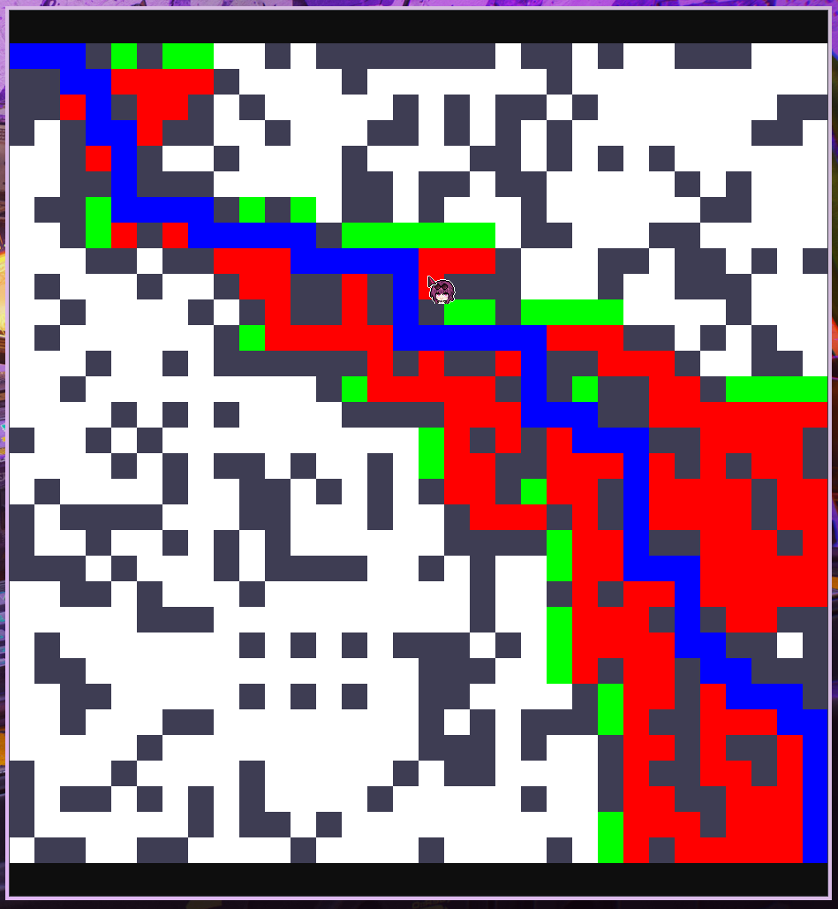
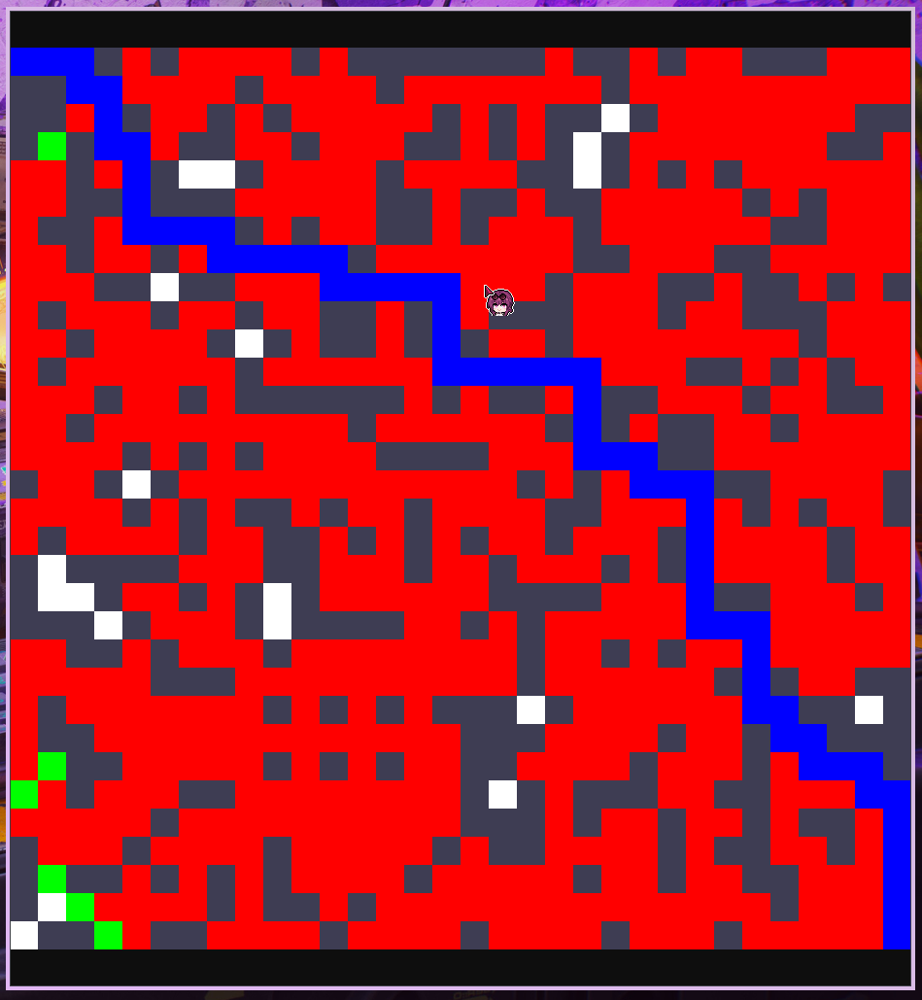
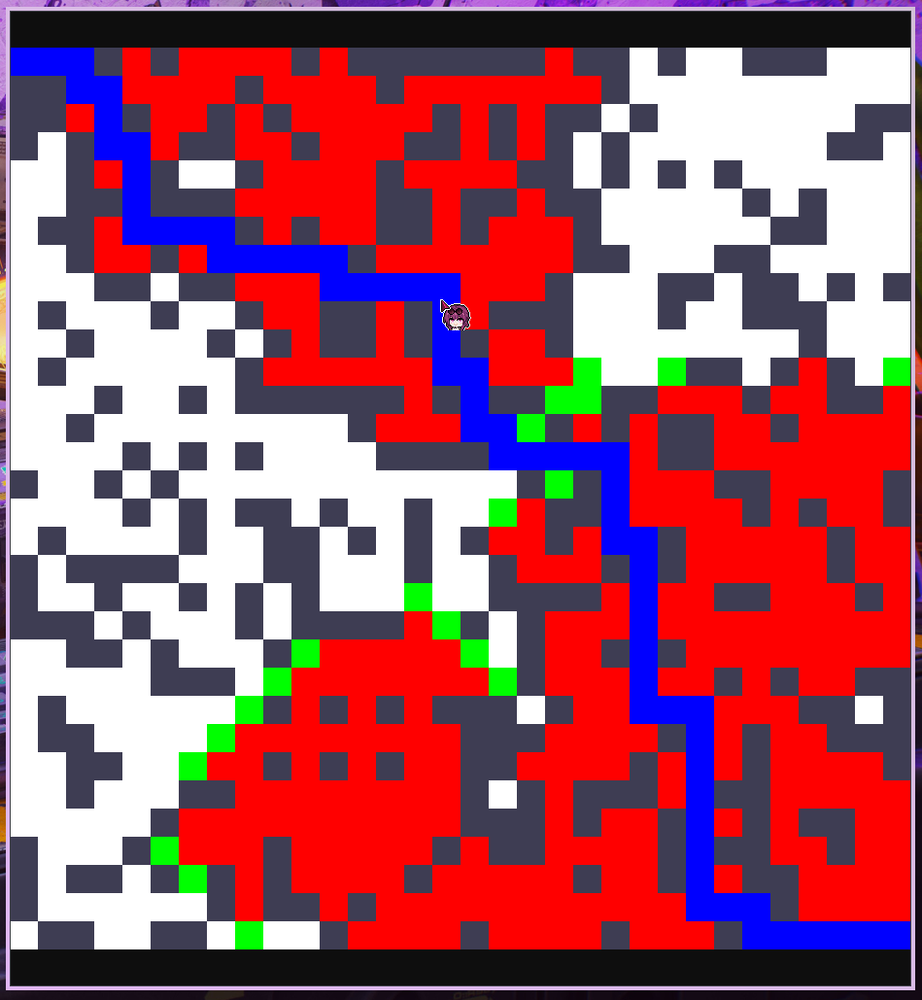

# Wegsuche
A graphical visualizer for various path finding algorithms

## Usage

Enter the development shell

```sh
nix develop
```

Install the non-nix packages

```sh
uv sync
```

Run using uv

```sh
uv run python main.py
```

## Showcase

Grid: 32x32
Seed: `seed used for test`

### A* Search



### Breadth-First Search



### Bi-directional Breadth-First Search


