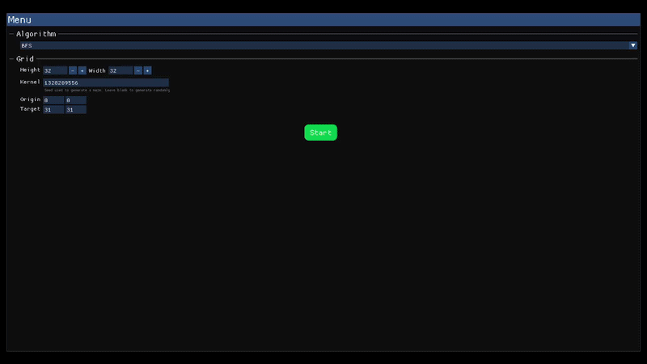

# Wegsuche

A graphical visualizer for various path finding algorithms

## Usage

Enter the development shell

```sh
nix develop
```

Install the non-nix packages

```sh
uv sync
```

Run using uv

```sh
uv run python main.py
```

## Showcase

Grid: 32x32

Seed: 1328209556

Root: (0, 0)

Goal: (31, 31)

### A* Search


### Breadth-First Search


### Bi-directional Breadth-First Search


